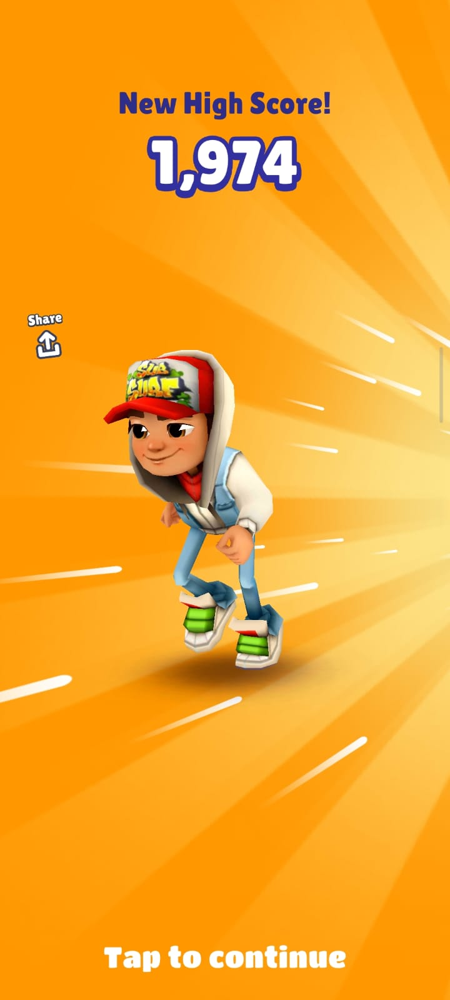
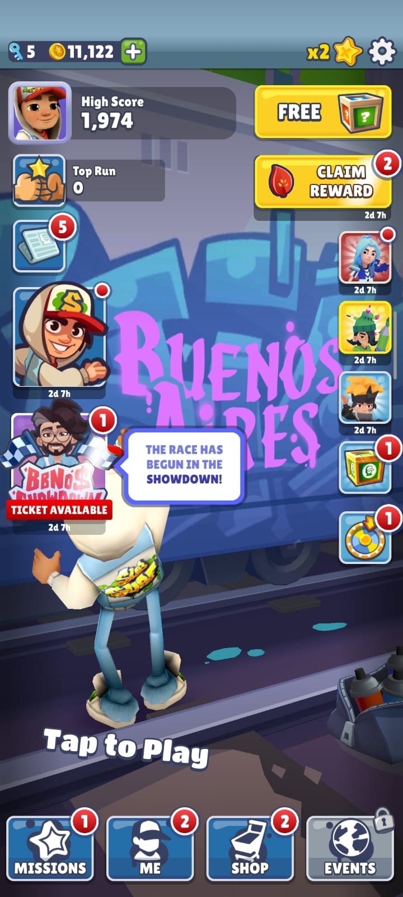
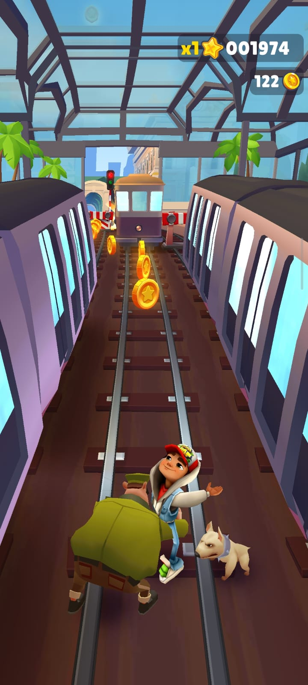
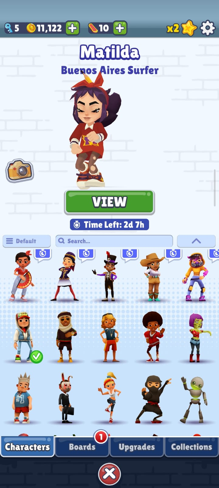
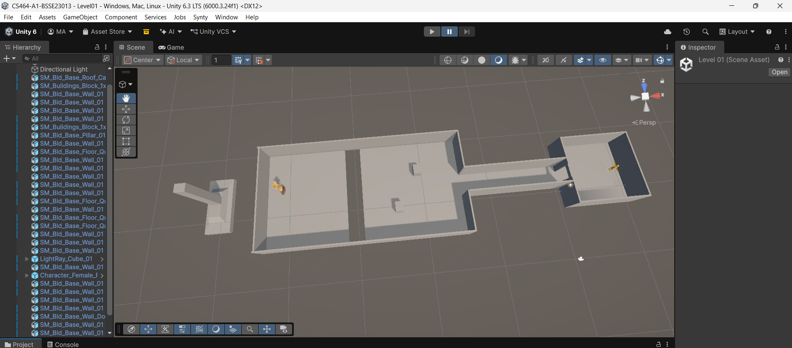
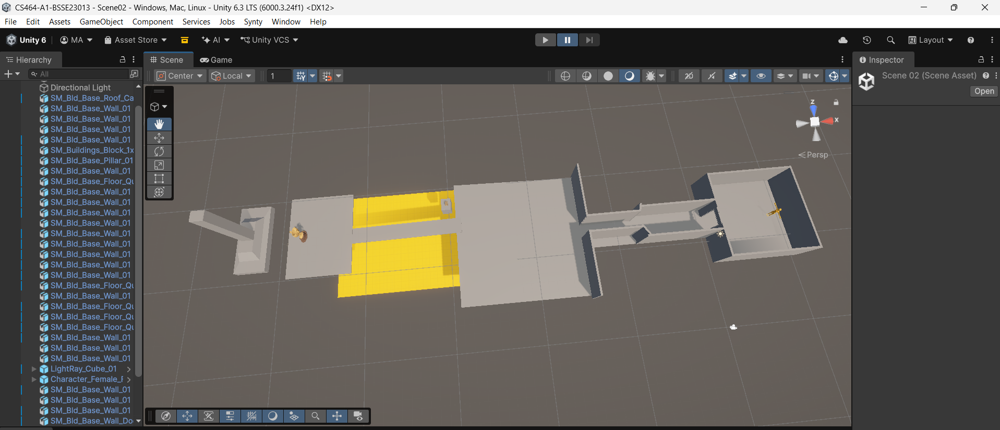
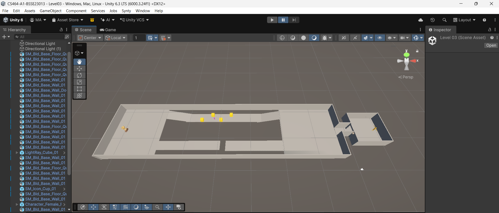
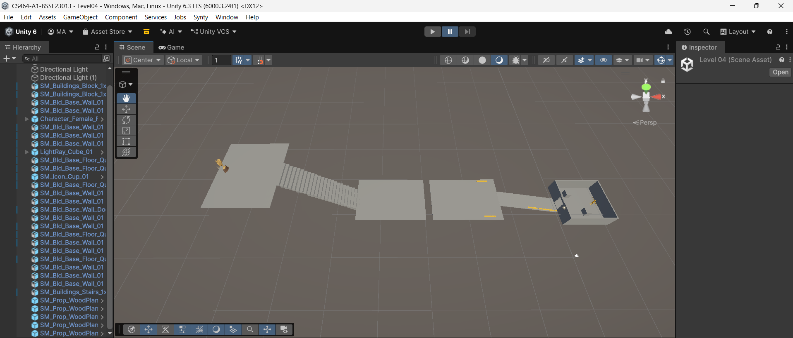
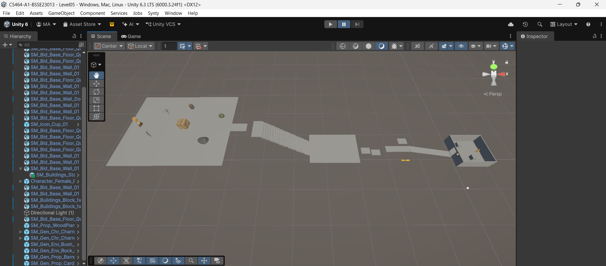

# CS464-A1-BSSE23013
# CS464 Assignment 01 · Muhammad Sarmad Ahmad · BSSE23013

## Game 1 · Subway Surfers

Store link: https://play.google.com/store/apps/details?id=com.kiloo.subwaysurf
Genre: Endless runner
I have played this game till gold level but now for this assignment i spent some time experiencing the game with a developers mind

1. [M1, M2] · [Image 1 shows how the runner achieves max score and Image 5 shows Low Hit and policeman comes closer but run continues]
2. [M3, M4] · [Image 2 shows the coins and score]
3. [M5, M7] · [image 2 and image 4 shows the store and the online match or offline play facility and leaderboards]

| # | Mechanic | Dynamic | Aesthetic | Bartle type |
|---|---|---|---|---|
| M1 | The runner always moves forward by itself. Swiping left or right changes one of three lanes, swiping up jumps and swiping down rolls. | Players keep looking ahead for trains and barriers and change lane every second or two. After a few runs they start to remember common obstacle layouts and move earlier. | Challenge: every swipe has to be timed and should be very accurate. | Achiever: Whenever you dodge any obstacle you feel a sense of achievement |
| M2 | Hitting a low barrier makes the runner stumble and lets the guard and dog catch up. A second hit soon after, or running straight into a train, ends the run. | After a stumble, players give up on coins and stay in the safest lane until the chaser falls back. Train fronts get avoided at all costs. | Challenge: any run can end on one mistake, so a long run feels earned. | Achiever: When you run long enough an break your own records of duration its feeling is magical. |
| M3 | Coins picked up in a run are saved to a wallet that stays between runs. They are spent in the store on characters, boards and upgrades. | Players leave a safe lane to follow a long line of coins, even when it is risky. They also save up for one particular item. | Challenge: coin lines tempt you into risk, so each pickup is a small gamble that paid off. | Achiever: there is a wallet to grow and a shop to fill. |
| M4 | Double-tapping the screen starts a hoverboard.  | It takes one crash (it breaks instead of the run ending) or runs out after a short time. Players hold the board back for later in a run when speed is high, or switch it on only when a crash feels close. | Challenge: a safety net that changes how much risk a player is willing to take. | Achiever: a tool for beating the game on its own terms. |
| M5 | The game shows a set of missions, such as collecting a number of coins. Finishing a whole set raises the score multiplier for later runs. | Players pick one mission and play for it, for example grabbing coins instead of chasing distance. A run becomes a small project. | Submission: runs are short and each has a small goal, so they fit into spare minutes. | Achiever: a checklist and a multiplier that keep growing. |
| M6 | Speed goes up the longer a run lasts, so obstacles arrive faster the further you get. | The start of a run feels relaxed. Players concentrate harder as speed rises, and most runs end around the point where reactions can't keep up. | Sensation: the rush of the faster screen and sound. Challenge comes with it. | Achiever: pushing past your own previous distance. |
| M7 | The game compares scores between players: friends' high scores and rankings are shown, and weekly events have leaderboards. | Players replay to beat a friend's score, and some share their best runs. | Fellowship: friends' scores turn a solo game into something shared. | Killer: beating other players is the point (weaker than the Achiever mechanics above). |

**Aesthetic profile:** Challenge leads, because every run can end on one mistake  and coin lines pull players toward risk. Submission and Sensation come next. Runs last about a minute and fit into spare time and the rising speed gives a rush .

**Player types**
- Primary: Achiever , because the whole game is about improving against its own rules: a higher score and distance , a growing wallet  and a multiplier that rises with missions .
- Secondary: Explorer : You try different option , tr hoverboard to save life use keys etc.

## Game 2 · Dr. Driving

- **Store link:** https://play.google.com/store/apps/details?id=com.ansangha.drdriving
- **Genre:** Driving simulation / racing
- I have played Dr. Driving and Dr. Driving 2 to maximum levels that i could unlock . For this assignment i played certain levels to find the mechanics of game and what the player feels

1. [M1, M3] · [screenshot 1 and 4shows steering through traffic , The guidlines , the steering and setting option where you can change sensitivity and steering options.]
2. [M2, M7] · [screenshot 5  shows a mission goal or the mode menu, screenshot 2 shows hit and fails]
3. [M4, M5] · [what screenshot 3 shows, the car shop or the fuel screen with all the settings for each car]

| # | Mechanic | Dynamic | Aesthetic | Bartle type |
|---|---|---|---|---|
| M1 | The player steers with an on-screen wheel or by tilting the phone, and holds accelerator and brake pedals. The car doesn't move on its own. | Players ease on and off the throttle to weave through traffic and take corners. Some switch to tilt steering because it feels more natural. | Sensation: the physical feel of tilting and driving a car. | Achiever: getting better at the controls is a skill you build. |
| M2 | Each mission has a goal and a rule, such as reaching a destination, parking in a marked bay or finishing under a time limit. | Players drive fast on open roads, then slow right down for parking or tight sections so they don't lose the mission. | Challenge: every mission is a small obstacle course with a clear pass or fail. | Achiever: a list of goals to complete. |
| M3 | Hitting another car or an object damages the car or fails the mission. | Players brake early at junctions and avoid risky overtakes in missions where collisions count. | Challenge: one mistake can ruin an attempt. | Achiever: failure is judged by the game's own rules. |
| M4 | Missions pay out coins. Coins buy new cars, and each car has its own speed and handling. | Players repeat missions to afford the next car, and pick a car to suit the job, such as a handier one for parking. | Fantasy: becoming the driver of better and better cars. | Achiever: a wallet that grows and cars to unlock. |
| M5 | Fuel is the energy limit: it is used up as you play and comes back with time or a purchase. | Players stop when the fuel runs out and return later, so the game gets played in short bursts. | Submission: short sessions around a refill timer. | Achiever: waiting on a resource that lets you progress. |
| M6 | In online multiplayer the player is matched against another driver in a live race. Winning gives rewards and ranking. | Players pick their fastest car and try risky overtakes to get ahead of a real opponent. | Challenge: beating a real person is harder than beating a mission. | Killer: your win is someone else's loss. |
| M7 | The game has separate modes with their own rules, such as Mission, Highway and parking modes, chosen from the menu. | Players try each mode and settle on one they like. Some stay in the open-road mode for relaxed driving. | Discovery: finding out what each mode offers. | Explorer: interacting with the world and learning how the modes differ. |

**Aesthetic profile:** Challenge leads, because missions and collisions give clear pass or fail moments . Sensation comes from the tilt and pedal controls , and Fantasy from owning better cars . Submission shows up through the fuel limit .

**Player types**
- Primary: Achiever , because progress is measured against the game itself: missions to pass, coins and cars to collect and controls.
- Secondary: Killer, because live races against other drivers make your win another player's loss. Explorers also show up through the modes.

## Level blockouts

| Level | Screenshot | Its idea | Wayfinding tool |
|---|---|---|---|
| Level01 |  | A first challenge: a coordor and one 2.5 m jump gap in an open yard. | Landmark: a tall yellow tower stands behind the goal. |
| Level02 |  | A tight squeeze that opens into a big hall, then a narrow bridge over a pit. | Pinch and release: the hall feels huge after the narrow corridor. Also has an enemy after the narrow bridge |
| Level03 |  | A split route: a short risky path having narrow way with blockages leading to reward against a longer safe one with a gap jump  | Breadcrumbs: small yellow cubes lead along the safe route into the reward. |
| Level04 |  | Vertical play: a ramp, a gap between platforms and a stair up to a rooftop goal. | Leading lines: floor stripes and low rails point up the ramp. |
| Level05 |  | A finale that combines the pinch, the gap, the climb and the split. | Framing, light and contrast: everything is dark grey except the bright goal inside a tall doorway. The challenge starts with narrow way facing upwards then there are two up and down jumps with stairs next to them when you climb up the stairs there is a jump to a narrow walkway leading to a fight zone with 2 zombies leading to the win |
